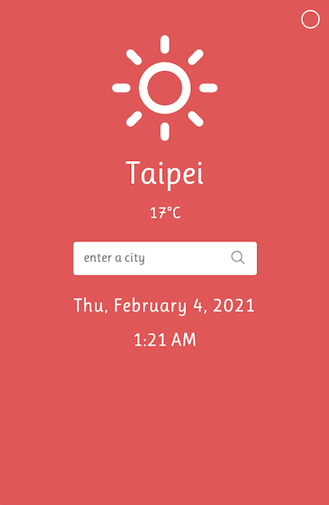

## Weather app

 

### Description
---
Simple UI interface with interactive design. Users can easily search the weather of current location or other cities and dynamically change background color.
 

### Main Features
---
- Unlimited location
- Current Weather information
- Customized Background Color
- Cross Browser Support
- Built With HTML5, CSS, SASS, and JavaScript
 

### Credits
---
- Google Fonts
- OpenWeatherMap API
- Iconify
- Weather Icons
- Moment.js
